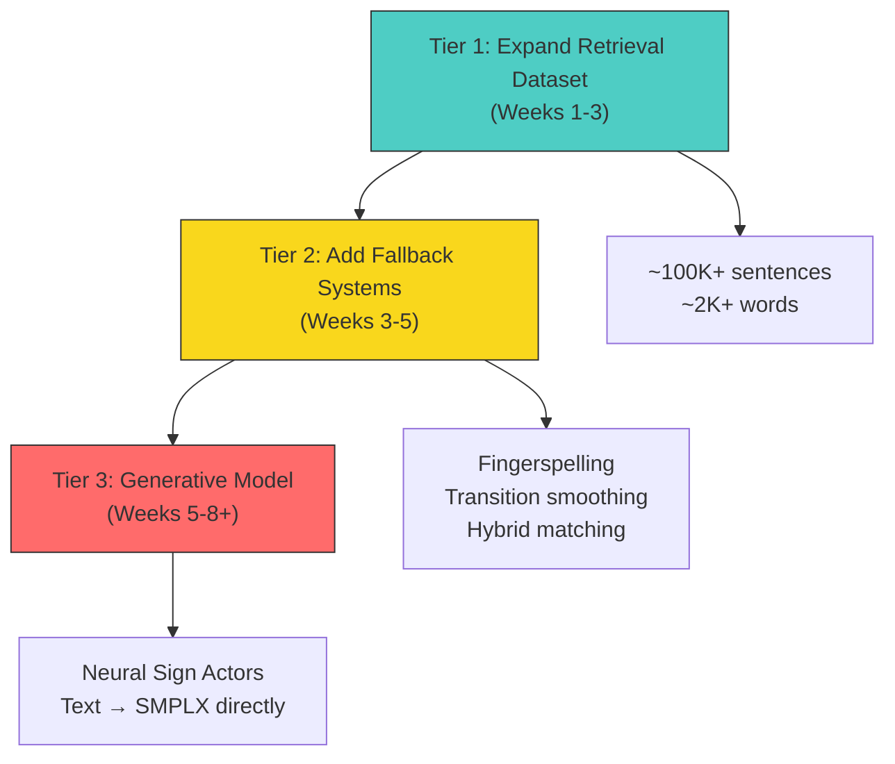
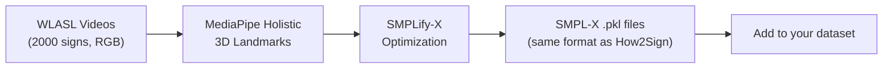
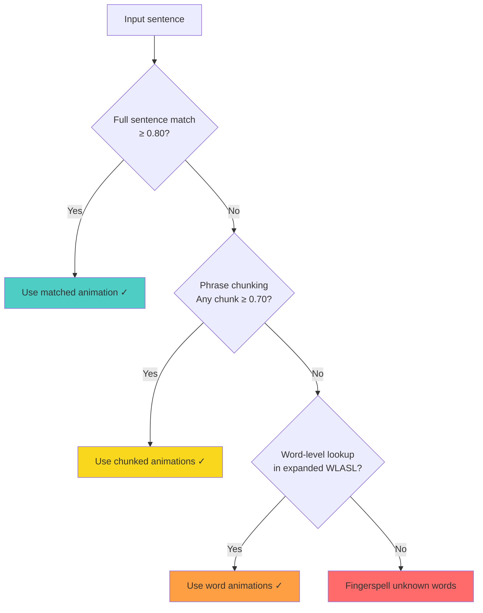
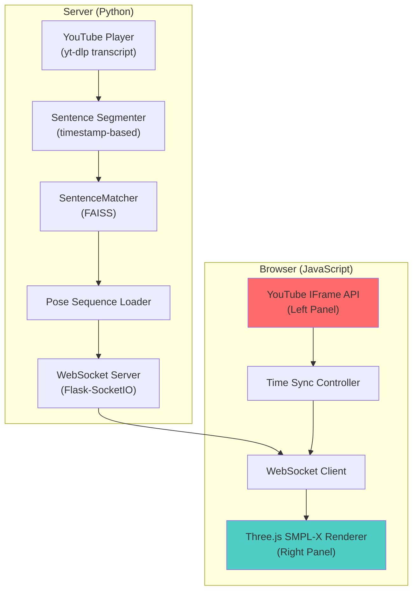

# Real-Time YouTube-to-ASL Side-by-Side Translation

## Goal

Build a system where a YouTube video plays on the left and a synchronized 3D ASL avatar animation plays on the right, with accurate sentence-level translation and robust fallback for missing vocabulary.

---

## The Core Problem: Dataset Coverage

Your current pipeline is **retrieval-based** — it can only play back pre-recorded animations. This fundamentally limits you to what's in the dataset. Here are three strategic tiers to solve this, in order of feasibility:



---

## Tier 1: Massively Expand the Retrieval Dataset

This is your biggest bang-for-buck. Going from 31K sentences to 100K+ dramatically improves semantic matching coverage.

### Strategy 1A: SignAvatars Dataset (ECCV 2024)

> [!IMPORTANT]
> **SignAvatars** is the largest available SMPL-X sign language dataset: **8.34 million frames, 70K+ sequences** across multiple sign languages including ASL.

| Detail | Info |
|--------|------|
| **Paper** | "SignAvatars: A Large-scale 3D Sign Language Holistic Motion Dataset" (ECCV 2024) |
| **Size** | 8.34M frames, 70K sequences |
| **Format** | SMPL-X annotations (body, hands, face) |
| **Languages** | ASL (How2Sign), German SL (PHOENIX14T), more |
| **Access** | Request form on [GitHub](https://github.com/ZhengdiYu/SignAvatars) |
| **Compatibility** | ⚠️ Their SMPL-X params may have different structure than your pkl files |

**Action items:**
1. Submit access request on the SignAvatars GitHub repo
2. Once downloaded, write a converter script that maps their SMPL-X parameter format to your existing `[N, 156]` format (global_orient + body_pose + hand_poses)
3. Build a unified mapping JSON that combines your existing `how2sign_mapping.json` with SignAvatars' text labels

### Strategy 1B: Neural Sign Actors Data (CVPR 2024)

> [!IMPORTANT]
> The Neural Sign Actors team has **publicly released** their curated 3D SMPL-X annotations for How2Sign via Dropbox. This is a higher-quality version of what you already have.

| Detail | Info |
|--------|------|
| **Paper** | "Neural Sign Actors: A diffusion model for 3D SLP from text" (CVPR 2024) |
| **Data** | [Dropbox link](https://www.dropbox.com/scl/fo/nc4qxrwqz1ze2b4dy5wce/h?rlkey=zyx550j0lx88kj7wx6nfp3wjr&dl=0) |
| **Format** | SMPL-X params (betas, body_pose, global_orient, hand poses, jaw, eyes) |
| **Quality** | Higher fidelity than standard How2Sign extraction — uses robust 4D reconstruction |
| **Compatibility** | Very high — same How2Sign sentences, just better SMPL-X fits |

**Action items:**
1. Download from the Dropbox link on their [project page](https://baltatzisv.github.io/neural-sign-actors/)
2. Compare their SMPL-X parameter structure to your existing pkl files
3. If compatible, this could be a **drop-in quality upgrade** for your existing 31K sentences
4. Their data also includes facial expressions (jaw_pose, expression coefficients) which your current system ignores

### Strategy 1C: Build a Video-to-SMPLX Pipeline for WLASL

Your WLASL dataset has 2,000 word-level signs as video. You can extract SMPL-X parameters from those videos:



**Pipeline:**
1. **MediaPipe Holistic** → Extract 2D/3D body + hand + face landmarks per frame
2. **SMPLify-X** (or **ExPose** / **PyMAF-X**) → Fit SMPL-X model to those landmarks
3. **Post-process** → Smooth, clamp hand poses (you already do this), save as pkl
4. **Map** → Create `wlasl_mapping.json` with `pkl_file → word` entries

**Tools:**
- [SMPLify-X](https://github.com/vchoutas/smplify-x) — official optimization-based fitting
- [ExPose](https://github.com/pgrady/ExPose) — regression-based, faster
- [PyMAF-X](https://github.com/HongwenZhang/PyMAF-X) — state-of-art whole-body mesh recovery
- [DexAvatar's SignHPoser](https://thecvf.com) — sign-language-specific hand priors for more realistic hand fitting

> [!WARNING]
> Video-to-SMPLX fitting is noisy, especially for hands. Use the **DexAvatar SignHPoser** hand priors if possible — they're trained specifically on signer hand poses and dramatically improve hand realism.

### Strategy 1D: Mine More Sentence Data from How2Sign

Your `how2sign_mapping.json` has ~31K entries. But the full How2Sign dataset has **~35K sentences** across train/val/test splits. You may be missing some.

**Action items:**
1. Cross-reference your mapping against the official How2Sign CSV (you have `how2sign_train - how2sign_train.csv`)
2. Check if there are val/test splits you haven't processed
3. Verify all pkl files in `how2sign_pkls_cropTrue_shapeFalse/` have corresponding mapping entries

---

## Tier 2: Robust Fallback Systems

Even with 100K+ sentences, there will always be input sentences that don't match well. You need graceful degradation.

### Strategy 2A: Fingerspelling Engine

When a word isn't in the dataset, real ASL interpreters **fingerspell** it. You should too.

```
Input: "The quasar emitted radiation"
       ↓
"The" → matched sentence fragment
"quasar" → NOT FOUND → fingerspell Q-U-A-S-A-R
"emitted radiation" → matched sentence fragment
```

**Implementation:**
1. Create 26 SMPL-X hand pose configurations (one per ASL letter)
2. Each letter = ~8–12 frames at 15fps (holding the handshape briefly)
3. Add transition frames between letters (coarticulation)
4. Store as `fingerspell_A.pkl` through `fingerspell_Z.pkl`
5. At runtime, concatenate letter sequences for any unknown word

**How to get the 26 hand poses:**
- **Option A (Manual):** Use the SMPL-X model viewer, manually set `right_hand_pose` for each ASL letter, export
- **Option B (From data):** Use the [Google ASL Fingerspelling Corpus](https://www.kaggle.com/competitions/asl-fingerspelling) (217K+ sequences with MediaPipe landmarks) → fit SMPLX → extract canonical poses per letter
- **Option C (DexAvatar):** The DexAvatar paper includes a collected fingerspelling dataset from 8 signers with SMPL-X annotations

### Strategy 2B: Transition Smoothing (SLERP Blending)

When concatenating sentence segments, add smooth transitions:

```python
def blend_sequences(seq_a, seq_b, blend_frames=8):
    """SLERP interpolation between end of seq_a and start of seq_b"""
    transition = np.zeros((blend_frames, seq_a.shape[1]))
    for i in range(blend_frames):
        alpha = i / blend_frames
        transition[i] = (1 - alpha) * seq_a[-1] + alpha * seq_b[0]
    return np.vstack([seq_a, transition, seq_b])
```

This eliminates the jarring "jump cuts" between concatenated animations.

### Strategy 2C: Improved Sentence Chunking

Replace the current naive `re.split(r'[.!?]+')` with:

1. **Use YouTube transcript timestamps** — each transcript entry already has `start` and `duration` fields. Group entries into natural sentence-like chunks based on pauses (gaps > 1 second)
2. **Use an NLP sentence segmenter** — like `stanza` or `nltk.sent_tokenize` which handle unpunctuated text better than regex
3. **Sliding window matching** — instead of splitting into discrete sentences, try overlapping windows of varying length (3-word, 5-word, 8-word, full sentence) and take the best match across all window sizes

### Strategy 2D: Hierarchical Fallback Chain



This gives you **100% coverage** — every input text produces some animation, with quality degrading gracefully.

---

## Tier 3: Generative Model (Advanced — Optional)

This is the long-term ideal: a model that **generates** novel SMPL-X motion from text, rather than retrieving pre-recorded clips.

### Option 3A: Fine-tune Neural Sign Actors

The Neural Sign Actors paper (CVPR 2024) describes exactly what you need:
- Input: English text
- Output: SMPL-X motion sequence
- Architecture: Diffusion model + anatomically-informed graph neural network
- Training data: How2Sign with SMPL-X annotations

**Feasibility:** The code and data are publicly available. But training requires significant GPU resources (A100-class GPUs) and deep ML expertise.

### Option 3B: Use a Motion Prior (Lighter Weight)

Instead of full text-to-motion generation, use a **motion prior** to interpolate between known poses:

1. Build a latent space of all your SMPL-X pose sequences using a VAE
2. For a new input sentence, find the 2-3 closest matches
3. Use the VAE to interpolate/blend in latent space → generate a novel sequence
4. This is much lighter than a full diffusion model

---

## Real-Time Side-by-Side Architecture

### Current Problem
Your current pipeline renders frame-by-frame using pyrender → imageio → MP4. This takes **minutes** and can't be real-time.

### Proposed Architecture



### Key Design Decisions

#### 1. Move rendering to the browser (Three.js)
- Export SMPL-X model as `.glb` file
- Use Three.js `SkinnedMesh` for real-time GPU-accelerated rendering
- Server sends **pose parameters** (compact: ~624 bytes/frame) not rendered frames
- Browser applies poses to the 3D mesh at 60fps

#### 2. Pre-compute and cache pose sequences
- On first request for a YouTube video, compute all sentence matches + load all pose sequences
- Cache the full timeline: `[{start_time, end_time, pose_sequence}, ...]`
- Stream pose data to browser via WebSocket, synchronized to YouTube playback position

#### 3. Use YouTube IFrame API for synchronization
```javascript
// Sync ASL avatar to YouTube video timestamp
player.addEventListener('onStateChange', (event) => {
    const currentTime = player.getCurrentTime();
    avatarController.seekTo(currentTime);
});
```

#### 4. Pre-process pipeline (runs once per video)
```
YouTube URL
    → Extract transcript with timestamps
    → Segment into sentences (by timestamp gaps)
    → Match each sentence via FAISS
    → Load corresponding SMPL-X pose sequences
    → Build timeline: [{sentence, start_sec, end_sec, pose_data}, ...]
    → Cache for future requests
    → Stream to browser on demand
```

---

## Open Questions

> [!IMPORTANT]  
> **Q1: Scope of the project.** This is an academic capstone project. How much time and compute do you have? The phased approach lets you stop at Tier 1+2 and still have a dramatically improved system over what you have now.

> [!IMPORTANT]
> **Q2: Real-time rendering approach.** Moving rendering to Three.js (browser-side) is the right engineering choice for real-time, but it's a significant frontend effort. Are you comfortable with JavaScript/Three.js, or would you prefer a simpler approach where the server pre-renders the full video and then plays it synced with YouTube?

> [!IMPORTANT]
> **Q3: Dataset access.** Can you submit access requests for:
> - SignAvatars (GitHub form)
> - Neural Sign Actors data (Dropbox — may be directly downloadable)
> - Official SMPL-X models (MPI website)

> [!IMPORTANT]
> **Q4: GPU availability.** Do you have access to a GPU for:
> - Running SMPLify-X to convert WLASL videos → SMPL-X (can run on a decent desktop GPU)
> - Fine-tuning a generative model (requires A100 or similar — Tier 3 only)

---

## Proposed Execution Phases

### Phase 1: Dataset Expansion (Week 1-2)
- [ ] Download Neural Sign Actors SMPL-X data from Dropbox
- [ ] Request access to SignAvatars dataset
- [ ] Write format converters to unify all datasets into your `[N, 156]` pkl format
- [ ] Merge all sentence mappings into a unified index
- [ ] Rebuild FAISS index with expanded dataset
- [ ] Persist FAISS index to disk (fix the cold-start problem)
- [ ] **Target: 70K-100K+ sentences**

### Phase 2: Fallback Systems (Week 2-3)
- [ ] Build fingerspelling engine (26 letter poses + transitions)
- [ ] Implement SLERP transition blending between segments
- [ ] Replace regex sentence splitting with timestamp-based segmentation
- [ ] Implement hierarchical fallback chain (sentence → chunk → word → fingerspell)
- [ ] Add facial expression pass-through from dataset (jaw_pose, expression)
- [ ] **Target: 100% input coverage with graceful degradation**

### Phase 3: Real-Time Side-by-Side UI (Week 3-5)
- [ ] Build Three.js SMPL-X renderer (or evaluate simpler pre-render approach)
- [ ] Build WebSocket server for pose streaming
- [ ] Build split-screen UI with YouTube IFrame API on left
- [ ] Implement time synchronization between video and avatar
- [ ] Add subtitle overlay on the avatar panel
- [ ] **Target: Working real-time side-by-side demo**

### Phase 4: Polish & Quality (Week 5-6)
- [ ] Optimize FAISS search with IVF index for faster matching
- [ ] Add caching layer for processed videos
- [ ] Improve chunking with sliding window approach
- [ ] Add confidence visualization in UI
- [ ] **Target: Demo-ready system**

### Phase 5 (Optional): Generative Model (Week 6+)
- [ ] Evaluate Neural Sign Actors codebase
- [ ] Train or fine-tune on expanded dataset
- [ ] Replace retrieval with generation for novel sentences
- [ ] **Target: True translation, not retrieval**

---

## Verification Plan

### Automated Tests
- Unit tests for format converters (SignAvatars → your format)
- Integration test: full pipeline from YouTube URL → pose sequences → rendered output
- FAISS index coverage test: what percentage of a test transcript's sentences match at ≥0.70?

### Manual Verification
- Side-by-side comparison of ASL output vs. ground truth How2Sign videos
- Deaf community review (if possible through your university connections)
- Measure end-to-end latency for the real-time pipeline

---

## Key Research References

| Paper | Year | Relevance |
|-------|------|-----------|
| **Neural Sign Actors** (Baltatzis et al.) | CVPR 2024 | Diffusion model for text→SMPLX sign production. Data available. |
| **SignAvatars** (Yu et al.) | ECCV 2024 | 8.34M frames, 70K sequences with SMPLX annotations. |
| **DexAvatar** | CVPR 2024 | Sign-language-specific hand priors (SignHPoser). Fingerspelling data. |
| **How2Sign** (Duarte et al.) | CVPR 2021 | Base dataset your system uses. |
| **WLASL** (Li et al.) | 2020 | 2000 word-level ASL signs as video. |
| **Progressive Transformer for SLP** | ECCV 2020 | Text→gloss→pose generation baseline. |
